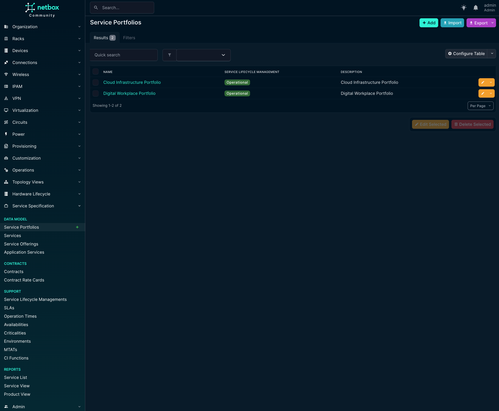
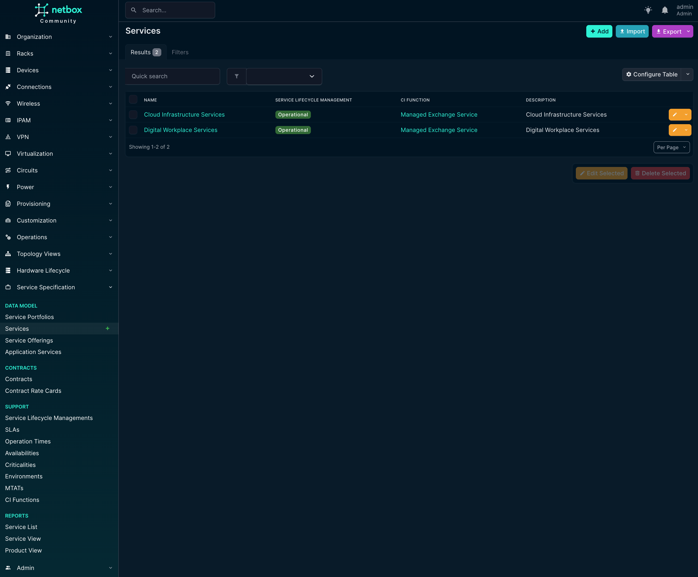
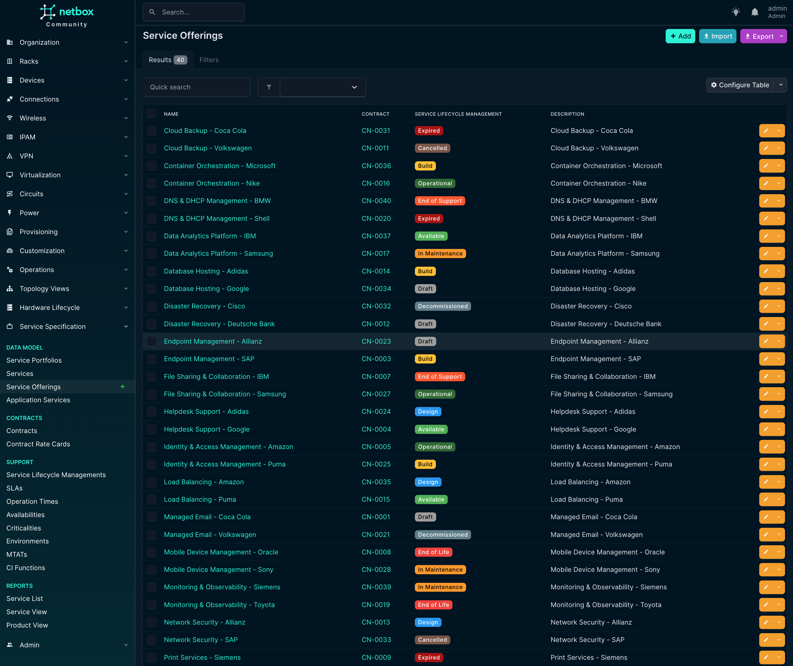
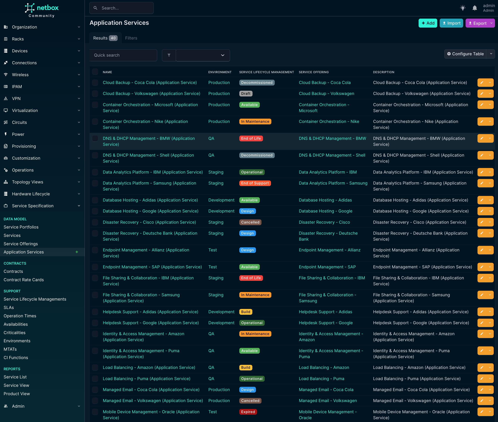
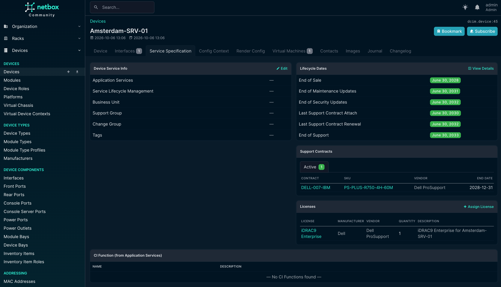

# netbox-service-offerings-plugin (Service Specification)

A [NetBox](https://github.com/netbox-community/netbox) plugin for building a **Service Specification** model
directly in NetBox. You describe Service Portfolios, Services, Service Offerings, Application Services and
Contracts, and link them to:

- the infrastructure NetBox already knows about (devices, virtual machines, clusters, cluster groups);
- the contacts, contact groups and tenants that own, support and buy them.

Reports then show the whole chain, from portfolio down to physical hardware, as a table or as an interactive graph.

The Python package is `netbox-service-specification`; the plugin's Django app label is `service_specification`.

## Screenshots

### Service Portfolios


### Services


### Service Offerings


### Application Services


### Devices


## Data model

Models are organized into the same groups as the plugin's navigation menu: **Data Model**, **Contracts** and
**Support**. A fourth menu group, **Reports**, is described under [Reports](#reports).

### Data Model group

A `Portfolio` groups one or more `Service`s. A `Service` is sold to customers as one or more `ServiceOffering`s.
Each `ServiceOffering` is realized by at most one `AppService`, and each `AppService` belongs to exactly one
`ServiceOffering` (a one-to-one relationship, enforced in the database).

| Model | Description |
| --- | --- |
| **Portfolio** (Service Portfolio) | Top-level grouping of related services. Has a `Lifecycle`, at least one owner and at least one manager (each a contact and/or contact group). |
| **Service** | A business or technical service in one or more portfolios. Has a `Lifecycle`, owner and manager (as above), business unit, support group and change group (contact groups), and an optional `CIFunction`. |
| **ServiceOffering** | A service as offered to customers. Belongs to one or more services. Has a `Lifecycle`, owner and manager (as above), business unit, support group and change group. Can be linked to a `Contract` and assigned to one or more customers (`Tenant`s) and/or customer groups (`TenantGroup`s). |
| **AppService** (Application Service) | The application-level realization of a *single* service offering. Carries operational commitments: accepted downtime, TTR, RPO, RTO and BCM, plus links to `SLA`, `OperationTime`, `Availability`, `Criticality` and `MTAT`. Requires an `Environment` and a `Lifecycle`. Its owner is *either* a Contact *or* a Contact Group, never both. It has no customer fields of its own: the customer is set once, on its Service Offering. |

Detail pages also show related context read-only:

- A Service Offering shows its parent Service(s) and their `CIFunction`(s).
- An Application Service shows the same, plus its Service Offering's customer and customer group.

These rollups are for context only. The relationships themselves are edited through the `service` and
`service_offering` fields.

### Contracts group

| Model | Description |
| --- | --- |
| **Contract** | Contract number, external reference, short description, legacy contract, project, parent contract, vendor (a NetBox `Manufacturer`), location, customer and customer group, contact person, primary contact, contract manager, approver, business unit, and start/end dates. Its **status** is computed, not stored: *Active* while at least one of its rate cards is active, otherwise *Inactive*. The detail page lists its rate cards. |
| **ContractRateCard** | One billing position of a contract: position number, active flag, short description, start/end dates, order number, base costs, hourly rate, hours spent, interval (*Monthly*, *One time cost*, *Others*), billing flag and project. **Total costs** are computed as base costs + hourly rate × hours spent. The detail page shows the customer from its contract. |

### Support group

Small lookup models referenced by the models above. Each has a name, slug, optional description, tags and
comments, plus the extra fields noted below:

| Model | Menu name | Extra fields | Used by |
| --- | --- | --- | --- |
| **Lifecycle** | Service Lifecycle Managements | `color` (default grey) | Portfolio, Service, ServiceOffering, AppService, and the Service Specification tab |
| **SLA** | SLAs | `sla_definition` | AppService |
| **OperationTime** | Operation Times | — | AppService |
| **Availability** | Availabilities | — | AppService |
| **Criticality** | Criticalities | — | AppService (as `service_criticality`) |
| **Environment** | Environments | — | AppService |
| **MTAT** | MTATs | `value` (integer), `unit` (Seconds/Minutes/Hours/Days/Weeks/Months/Years) | AppService |
| **CIFunction** | CI Functions | — | Service. Its detail page lists the Services using it, plus the Devices, Virtual Machines, Clusters and Cluster Groups that inherit it. |

All models support NetBox's standard object features: tags, comments (Markdown), custom fields, custom links,
change logging, journaling and bookmarks.

### Service Specification on core NetBox objects

`Device`, `VirtualMachine`, `Cluster` and `ClusterGroup` are core NetBox models, and plugins can't add database
fields to them. Instead, each gets a **Service Specification** tab on its detail page (for example
`/dcim/devices/<id>/service-specification/`). The tab is backed by a plugin-owned side table
(`DeviceServiceInfo`, `VirtualMachineServiceInfo`, `ClusterServiceInfo`, `ClusterGroupServiceInfo`) with a
one-to-one link to the core object.

Each side table holds:

- the `AppService`(s) the object supports (multi-select);
- a `Lifecycle`;
- Business Unit, Support Group and Change Group (contact groups only, no individual contacts).

There's no direct `CIFunction` field. It's shown read-only, derived from the linked Application Services'
Service Offering → Service. The tab itself is read-only; an **Edit** button opens the matching form.

The side tables have no entries in the plugin's navigation menu. In the UI you reach them only through the core
object's tab. They are available in the REST API (see [REST API](#rest-api)).

## Reports

Read-only views under **Service Specification → Reports**:

- **Service List.** A table with one row per customer (Tenant) and Service Offering. Columns: tenant, tenant
  group, service offering, its lifecycle, contract, contract location, sites and application services. Filters:
  tenant, tenant group, service offering, service offering lifecycle, contract and application service. A tenant
  matches offerings assigned to it directly or through its tenant group.
- **Service View.** An interactive graph of Portfolio → Service → Service Offering → Application Service →
  Technical CI (the Devices, VMs, Clusters and Cluster Groups linked through their Service Specification tab).
  You can zoom, pan and drag nodes sideways, and click any node to open the object.
- **Product View.** The same graph, extended below each Technical CI into its real infrastructure:
  - **Device:** *Physical* (devices it is cabled to), *Logical* (devices with an IP in the same subnet) and
    *Virtualization* (its cluster).
  - **Virtual Machine:** its host server, cluster and cluster group.
  - **Cluster:** its member devices and cluster group.
  - **Cluster Group:** its clusters and their member devices.

Service View and Product View share one filter form: Customer, Service Portfolio, Service, Service Offering,
Application Service, Device, Virtual Machine, Cluster and Cluster Group. The dropdowns cascade:

- Picking a **Customer** narrows the Service Offering dropdown.
- Picking a **Customer** and/or **Service Offering** narrows the Application Service, Device, Virtual Machine,
  Cluster and Cluster Group dropdowns to objects belonging to that selection.
- Picking an **Application Service** narrows the four infrastructure dropdowns the same way.

The dropdowns match a customer only when it's assigned *directly* to a Service Offering. The graph itself also
matches offerings assigned through the customer's tenant group.

## Compatibility

| Plugin Version | NetBox Version | Python Version |
| --- | --- | --- |
| 1.0.x | 4.6.x (minimum 4.6.0) | \>= 3.10 |

The combination actually built and deployed by this repo's CI/CD pipeline is pinned in [`versions.sh`](versions.sh)
(currently NetBox `v4.6.5`).

## Installation

### Option A: existing NetBox installation

Install the plugin into NetBox's virtual environment:

```bash
source /opt/netbox/venv/bin/activate
pip install git+https://github.com/<org>/netbox-service-offerings-plugin.git
```

Enable it in `/opt/netbox/netbox/netbox/configuration.py` (or `plugins.py` if you split your config that way):

```python
PLUGINS = [
    "service_specification",
]
```

Then run migrations and collect static files as usual:

```bash
python manage.py migrate
python manage.py collectstatic --no-input
```

Restart NetBox (`systemctl restart netbox netbox-rq` or equivalent).

### Option B: Docker (bundled demo/CI stack)

This repo includes a full Docker Compose deployment under [`ci/docker/`](ci/docker/). It builds NetBox with this
plugin baked in via [`ci/docker/Dockerfile-Plugins`](ci/docker/Dockerfile-Plugins), together with two third-party
plugins from [`ci/docker/plugin_requirements.txt`](ci/docker/plugin_requirements.txt):
[netbox-topology-views](https://github.com/netbox-community/netbox-topology-views) and
[netbox-lifecycle](https://github.com/DanSheps/netbox-lifecycle) (Hardware Lifecycle).

This is the stack [`.github/workflows/ci-cd.yml`](.github/workflows/ci-cd.yml) deploys on every push. NetBox is
published on host port **8080**. HTTPS and the public hostname are handled by an external nginx reverse proxy,
maintained in a separate repository, which forwards to that port. To run it yourself:

```bash
source versions.sh
cp ci/docker/.env.example ci/docker/.env   # fill in real values, see comments in the file
docker compose --env-file ci/docker/.env -f ci/docker/docker-compose.yml up -d --build
# NetBox is then reachable at http://localhost:8080
```

`ALLOWED_HOSTS` and `CSRF_TRUSTED_ORIGINS` are set in
[`ci/docker/docker-compose.yml`](ci/docker/docker-compose.yml). Add your own hostname or IP there if you access the
stack by a name other than `localhost`.

## Usage

### Web UI

Once enabled, a **Service Specification** entry appears in NetBox's navigation menu with four groups:
**Data Model**, **Contracts**, **Support** and **Reports**. Each model gets the standard NetBox list (with
filtering), detail, add, edit and delete views. Bulk edit, bulk delete and CSV import aren't provided in the UI; use
the REST API's bulk operations instead.

### REST API

All models are exposed under `/api/plugins/service-specification/`, following NetBox's usual REST conventions:
list/detail views, filtering, `?brief=true` and bulk operations. Endpoint names are plural and match the plugin's
UI paths exactly. For example, UI `/plugins/service-specification/lifecycles/` maps to API
`/api/plugins/service-specification/lifecycles/`. On any plugin page, adding `/api` right after the hostname takes
you to the same list in the browsable API.

Two groups of endpoints have no UI list page of their own:

- **Service Specification tab data:** `device-service-infos/`, `virtual-machine-service-infos/`,
  `cluster-service-infos/` and `cluster-group-service-infos/`.
- **Technical CI lookups:** `technical-ci/devices/`, `technical-ci/virtual-machines/`, `technical-ci/clusters/`
  and `technical-ci/cluster-groups/`. These behave like NetBox's own Device/VM/Cluster/Cluster Group lists, with
  the same results and permissions. They add three filters following the plugin's links: `offering_tenant_id`,
  `service_offering_id` and `app_service_id`. The Service View and Product View filter dropdowns use them.

Example: create a `Lifecycle`, then read it back:

```bash
curl -X POST https://<netbox-host>/api/plugins/service-specification/lifecycles/ \
  -H "Authorization: Bearer nbt_<key>.<secret>" \
  -H "Content-Type: application/json" \
  -d '{"name": "Pilot", "slug": "pilot"}'

curl https://<netbox-host>/api/plugins/service-specification/lifecycles/ \
  -H "Authorization: Bearer nbt_<key>.<secret>"
```

(Use `Authorization: Token <value>` instead if you're using a legacy v1 API token.)

### GraphQL

If `GRAPHQL_ENABLED` is on, all Service Specification models are also queryable at `/graphql/`, for example:

```graphql
query {
  portfolio_list {
    name
    lifecycle { name }
  }
}
```

### Permissions

Access is controlled by NetBox's standard per-model permissions, for example `service_specification.view_service`,
`service_specification.add_service`, `service_specification.change_service` and
`service_specification.delete_service`, and the same for every other model. The Reports views need no extra
permission: any user who can log in can open them. The Technical CI lookup endpoints use the core permissions
(`dcim.view_device`, `virtualization.view_virtualmachine`, and so on).

## Development

| Path | Purpose |
| --- | --- |
| [`service_specification/`](service_specification/) | The plugin itself: models, REST API, UI views, reports, GraphQL, migrations, tests. |
| [`ci/docker/`](ci/docker/) | Docker Compose stack and Dockerfile, used both for local runs and the CI/CD deploy. |
| [`ci/scripts/`](ci/scripts/) | Scripts used by the CI/CD pipeline: pre-cleanup, smoke test, demo data generation and seeding. |
| [`versions.sh`](versions.sh) | Single source of truth for the pinned NetBox version and the plugin's own release version. |
| [`pyproject.toml`](pyproject.toml) | Package metadata, plus `ruff` lint/format configuration. |

Run the test suite and linters the same way CI does (the tests need a NetBox environment, e.g. the Docker stack):

```bash
ruff check service_specification/
ruff format --check service_specification/
python manage.py test service_specification
```

### Demo data

[`ci/scripts/test-deployment.json`](ci/scripts/test-deployment.json) holds the demo dataset. It's generated by
[`ci/scripts/generate_test_deployment_data.py`](ci/scripts/generate_test_deployment_data.py) and loaded through
the REST API by [`ci/scripts/test-deployment.py`](ci/scripts/test-deployment.py). The dataset contains 20 tenants,
each with:

- a site;
- a firewall cabled to 2 switches, which are cabled to 4 servers (cables belong to the tenant);
- 2 clusters in a cluster group, and 6 VMs;
- Service Offerings, Application Services and Contracts across two Service Portfolios.

It also includes Hardware Lifecycle (netbox-lifecycle) data for every device: per-device-type lifecycle
milestones, plus support contracts, SKUs, licenses and per-device assignments.

To change the dataset, edit the generator, re-run it and commit the regenerated JSON:

```bash
python3 ci/scripts/generate_test_deployment_data.py
```

### CI/CD

[`.github/workflows/ci-cd.yml`](.github/workflows/ci-cd.yml) runs on every push to `main`, as six staged jobs:

1. **Pre-Clean** tears down this repo's previously running stack *and wipes its named volumes*
   ([`ci/scripts/pre-cleanup.sh`](ci/scripts/pre-cleanup.sh)), so every deploy starts NetBox from a completely
   empty database. It never touches the external nginx or a sibling plugin's stack.
2. **Code-Review** runs `ruff`, `shellcheck`, `yamllint`, and a check that `pyproject.toml`'s version matches
   `versions.sh`. It runs on a GitHub-hosted runner.
3. **Build** builds the NetBox + plugins Docker image per `versions.sh`.
4. **Test** deploys the stack (NetBox on host port 8080), then runs:
   - `manage.py check`;
   - a migration drift check;
   - the Django test suite;
   - a live smoke test against `http://localhost:8080` (session login plus a full API POST/GET/PATCH/DELETE round
     trip).
5. **Test Deployment** seeds the verified instance with the [demo data](#demo-data) through the REST API.
6. **Deploy** tags the repo `v<SERVICE_SPECIFICATION_PLUGIN_VERSION>` (from `versions.sh`), if that tag doesn't
   already exist.

The instance left running after a successful pipeline doubles as a live showcase. Every deploy wipes the
database, so the showcase holds exactly the freshly seeded demo data and never carries anything over from a
previous deploy. This is also why the plugin's migration
([`service_specification/migrations/0001_initial.py`](service_specification/migrations/0001_initial.py)) is
hand-edited in place for schema changes rather than accumulating incremental migration files: there's never an
already-migrated instance whose data a later migration would need to preserve.

#### Reverse proxy

This repo's stack doesn't run nginx or manage TLS certificates. The runner sits behind an nginx reverse proxy
configured in a separate, independent repository. That proxy terminates HTTPS for `cmdbaas.hyben.net` and forwards
to NetBox on the runner's port **8080**. The pipeline's own checks talk to `http://localhost:8080` directly, so
they don't depend on that proxy.

## License

[MIT](LICENSE)
